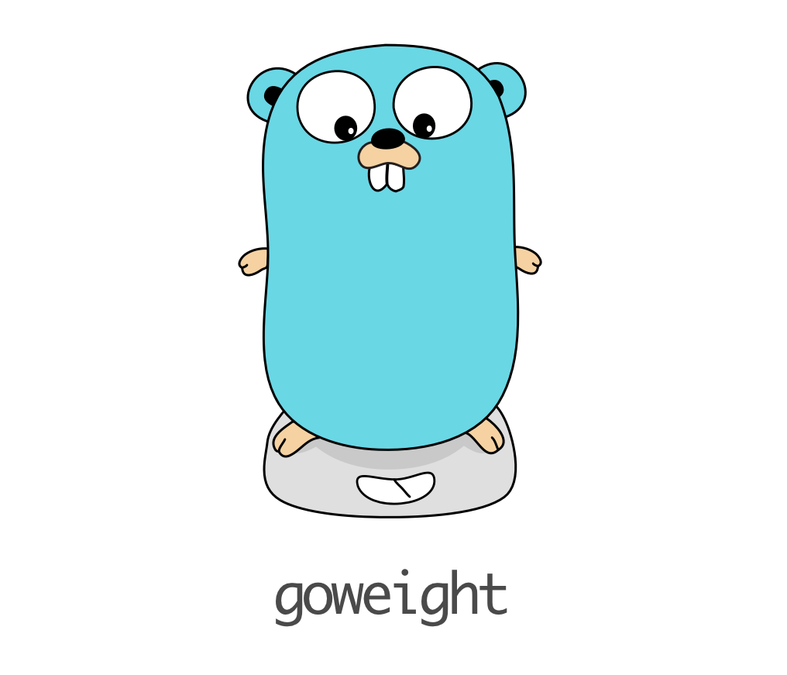

# goweight

A tool to analyze and troubleshoot a Go binary size.

✅ Get a breakdown of all modules inside a binary  
✅ Supports Go 1.11 modules  
✅ Output as JSON for tracking and/or monitoring as part of CI  


## Quick Start

### With Go Modules - Go 1.11 or higher

```
$ go install github.com/Bevisy/goweight
```

### Without Go Modules - Before Go 1.11

```
$ git clone https://github.com/Bevisy/goweight
$ cd goweight
$ go install
```


As an example, here's what `goweight` has to say about itself:

```
❯ ./goweight
execute: go build -C /root/go/src/github.com/bevisy/goweight -o goweight-bin-target -work -a
   13 MB runtime
  2.9 MB reflect
  2.3 MB math/big
  2.1 MB github.com/thoas/go-funk
  1.8 MB syscall
  1.6 MB encoding/json
  1.3 MB os
  1.3 MB time
  1.1 MB internal/abi
  976 kB regexp/syntax
  961 kB fmt
  823 kB internal/reflectlite
  ...
```

Or take the kube-apiserver component in kubernetes as an example:
```
❯ goweight ./cmd/kube-apiserver
execute: go build -C /root/go/src/github.com/kubernetes/kubernetes -o goweight-bin-target -work -a ./cmd/kube-apiserver
   93 MB github.com/Azure/azure-sdk-for-go/services/network/mgmt/2019-06-01/network
   56 MB github.com/aws/aws-sdk-go/service/ec2
   55 MB github.com/vmware/govmomi/vim25/types
   51 MB google.golang.org/api/compute/v0.alpha
   45 MB google.golang.org/api/compute/v0.beta
   40 MB google.golang.org/api/compute/v1
   38 MB github.com/Azure/azure-sdk-for-go/services/compute/mgmt/2019-12-01/compute
   27 MB github.com/GoogleCloudPlatform/k8s-cloud-provider/pkg/cloud
   22 MB k8s.io/api/core/v1
   14 MB github.com/Azure/azure-sdk-for-go/services/storage/mgmt/2019-06-01/storage
   12 MB runtime
   11 MB github.com/google/cel-go/parser/gen
   11 MB k8s.io/legacy-cloud-providers/gce
```

# Copyright

Copyright (c) 2024 [@Bevisy](https://github.com/Bevisy).  
Copyright (c) 2018 [@jondot](http://twitter.com/jondot).  
See [LICENSE](LICENSE.txt) for further details.
